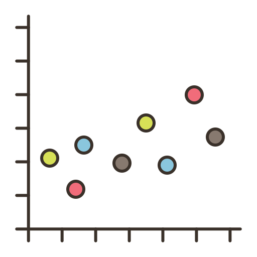

---
output:
  xaringan::moon_reader:
    lib_dir: libs
    nature:
      highlightStyle: github
      highlightLines: true
      countIncrementalSlides: false
    css: ["chocolate-fonts", "styles.css"]
    seal: false
    includes:
      in_header: fonts.html
---

class: center, middle, inverse, title-slide

<div>
  
  <p style = "position: absolute; font-family: Ubuntu Condensed; font-size: 20px; top: 23px; left: 50%; transform: translate(-50%, -50%);">MAT02035 - MODELOS PARA DADOS CORRELACIONADOS</p>
  
</div>

<h1 id="h1-capa">Modelos de Transição<br>(Modelos de Markov)</h1>

<div id = "texto-medio-esquerda"> 
  <h4 style = "font-family: Abel">Angelo Rosa<br>Camila Leuck<br>Gabriel Grandemagne<br>Raquel Rossi<br>Vítor Coutinho</h4>
</div>

<div id = "texto-medio-direita"> 
  <h4 style = "font-family: Abel"><br><br>Professor: Rodrigo Citton</h4>
</div>

<div id="texto-baixo">
  <p style = "font-family: Ubuntu Condensed; font-size: 20px;">Atualizado em `r Sys.setlocale('LC_ALL', 'Portuguese_Brazil.1252'); format(Sys.Date(), format = '%d de %B de %Y')`</p>
</div>

---

```{r prep, include=FALSE, echo = FALSE, warning = FALSE, error = FALSE, message = FALSE}
# Comentários relevantes:
#   - Na seção dos dados categóricos, talvez seja legal botar a parte sobre testar modelos mais simples.

# Opções do knitr/rmarkdown/xaringan:
options(htmltools.dir.version = FALSE)

##############
# Libraries: #
##############
ler_libs <- function(packages){
  instalar <- packages[!(packages %in% installed.packages()[, "Package"])]
  
  if(length(instalar) > 0){
    install.packages(pkgs = instalar, dependencies = TRUE)
  }
  invisible(sapply(packages, require, character.only = TRUE))
}

ler_libs(packages = c("dplyr", "nlme"))

###################
# Bases de Dados: #
###################
# Importando a base do exemplo de dados categóricos, selecionando somente as variáveis necessárias e ordenando-a por ID e tempo:
base <- read.table("https://faculty.washington.edu/heagerty/Books/AnalysisLongitudinal/xerop.data",
                   col.names = c("ID", "infec_resp", "intercecpto", "idade_meses", "xeroftalmia", 
                                 "cosseno_tempo", "seno_tempo", "sexo", "altura",
                                 "atrofia", "tempo", "idade_ldb", "estacao", "tempo_x_tempo")) %>%
          dplyr::arrange(ID, tempo)

# Criando variável referente ao primeiro lag:
base$xeroftalmia_lag1 <- numeric(nrow(base))
base[1, 15] <- NA

for(linha in 1:(nrow(base) - 1)){
  base[linha + 1, 15] <- ifelse(base[linha, ]$ID != base[linha + 1, ]$ID,
                                NA,
                                ifelse(base[linha, ]$tempo != base[linha + 1, ]$tempo - 1,
                                       NA,
                                       ifelse(base[linha, ]$xeroftalmia == 1, 1, 0)))
}

# Criando variável referente ao segundo lag:
base$xeroftalmia_lag2 <- numeric(nrow(base))
base[1, 16] <- NA
base[2, 16] <- NA

for(linha in 1:(nrow(base) - 2)){
  base[linha + 2, 16] <- ifelse(base[linha + 1, ]$ID != base[linha + 2, ]$ID | base[linha, ]$ID != base[linha + 2, ]$ID,
                                NA,
                                ifelse(base[linha + 1, ]$tempo != base[linha + 2, ]$tempo - 1 | base[linha, ]$tempo != base[linha + 2, ]$tempo - 2,
                                       NA,
                                       ifelse(base[linha, ]$xeroftalmia == 1, 1, 0)))
}
```

# Introdução

- Neste seminário, serão estudados modelos de transição
  + Também chamados de modelos de Markov
  + Condicionam respostas atuais a respostas anteriores dos indivíduos, captando mais informação sobre efeitos intra-individuais

- Será dado enfoque especial a extensões dos GLMs discutidos para dados categóricos e para dados de contagem nas últimas seções

---

# Definições Importantes

É necessário debater dois pontos antes de iniciarmos:

- **Cadeias de Markov**
  + Aqui, o importante é notar a **dependência** entre $X_0,\,\dots,\,X_n$
  + Dado um espaço de estados $E$, uma distribuição $\{p_i\}_{i\in E}$ é uma matriz **markoviana** $P$ e uma sucessão de variáveis aleatórias $\{X_n\}_{n=0,\,1,\,...}$ é uma **cadeia de Markov** se e somente se:

<p style = "text-align: center;">$$p[X_0=i_0,\,...,\,X_n=i_n]=p_{i_0}p_{i_0}i_1\,...\,p_{i_{n-1}}i_n\,\,\,\forall{n},\,\,\forall{i_1,\,...,\,i_n\in{E}}$$</p>
  
- **Modelos Lineares Marginais** (como citado na apresentação de **10/12**):
  + Podem ser considerados como uma extensão dos MLG que incorpora a **associação intra-individual entre as visitas**

---

# Motivação

- Modelos marginais não captam todos efeitos **intra**-indivíduos em estudos longitudinais, apesar de permitirem a especificação de uma estrutura para a matriz de covariância
  + Não levam em conta a **distribuição** de $Y_i$ nas visitas anteriores 
  
- Modelos de efeitos aleatórios não resolvem esta questão, pois lidam com a heterogeneidade **entre** indivíduos

- Para resolver este problema, foram desenvolvidas extensões de MLGs para descrever a distribuição condicional da resposta $y_{ij}$ do indivíduo $i$ no tempo $j$ como uma função explícita de suas respostas nos tempos anteriores, dadas por $y_{ij-1},\,y_{ij-2},\,...,\,y_{i1}$, e das covariáveis $x_{ij}$
  + Nestes modelos, presume-se que as observações passadas $y_{ij-1},\,\dots,\,y_{i1}$ compõem uma **cadeia de Markov**

---

class: img-page

<h1 id="h1-capa" style = "font-family: Abel; text-align: center;">Modelos de Markov</h1>

<i id = "img-center"></i>

---

# Modelos de Markov

- Denotaremos o **histórico** do sujeito $i$ no tempo $j$ por:

<p style = "text-align: center;">$$\mathcal{H}_{ij}=\{y_{ik},\, k = 1,\,...,\,j-1\}$$</p>

- A forma geral do MLG em questão, para $\psi(\theta_{ij})$ e $c(y_{ij},\,\phi)$ conhecidas, é:

<p style = "text-align: center;">$$f(y_{ij}|\mathcal{H}_{ij})=\mathbb{exp}\Big\{\frac{y_{ij}\theta_{ij}-\psi(\theta_{ij})}{\phi}+c(y_{ij},\,\phi)\Big\}$$</p>

- A média e variância condicionais são dadas por:

<p style = "text-align: center;">$$\mu_{ij}^{C}=\mathbb{E}(Y_{ij}|\mathcal{H}_{ij})=\psi'(\theta_{ij})\,\,\text{ e }\,\,v_{ij}^{C}=\mathbb{Var}(Y_{ij}|\mathcal{H}_{ij})=\psi''(\theta_{ij})\phi$$</p>

- Os modelos de transição mais úteis são cadeias de Markov em que a distribuição condicional de $y_{ij}$ dado $\mathcal{H}_{ij}$ depende somente das $q$ observações anteriores
  + Neste caso, $q$ é chamado de **ordem** do modelo

---

# Modelos de Markov

- Vamos considerar modelos em que a média e variância condicionais satisfazem as equações abaixo, em que $h$ e $v$ são as funções de ligação e variância (**conhecidas** de acordo com a distribuição de $f(y_{ij}|\mathcal{H}_{ij})$):

<p style = "text-align: center;">$$\begin{cases}h(\mu_{ij})^C=x'_{ij}\beta+\sum_{r=1}^{s}f_r(\mathcal{H}_{ij};\alpha)\text{,  para }f_r(\cdot)\text{ válidas;}\\v_{ij}^C=v(\mu_{ij}^C)\phi\end{cases}$$</p>

- Expressando $\mu_{ij}^C$ como função tanto de $x_{ij}$ quanto de $y_{ij-1},\,\dots,\,y_{ij-q}$, estamos tratando as respostas anteriores de cada indivíduo como variáveis explicativas adicionais
  + Presumimos que o passado afeta o futuro como uma soma de $s$ termos, cada um destes podendo depender de suas $q$ observações anteriores
  
---

# Modelos de Markov - Exemplos

- Um modelo de regressão linear com erros autorregressivos para dados Gaussianos é um modelo markoviano, de forma:

<p style = "text-align: center;">$$Y_{ij}=x'_{ij}\beta+\sum_{r=1}^{q}\alpha_r(Y_{ij-r}-x'_{ij-r}\beta)+Z_{ij}$$</p>

- Neste modelo, presumimos que os $Z_{ij}$ são independentes e têm distribuições Normais com médias zero

- Este é um modelo de transição com $h(\mu_{ij}^C)=\mu_{ij}^C$, $v(\mu_{ij}^C)=1$ e $f_r(\mathcal{H}_{ij};\alpha)=\alpha_r(y_{ij-r}-x'_{ij-r}\beta)$

- Notar que a observação atual, $Y_{ij}$, é função linear tanto de $x_{ij}$ quanto dos **desvios** anteriores, $Y_{ij-r}-x'_{ij-r}\beta,\,\,r=1,\,\dots,\,q$

---
# Modelos de Markov - Exemplos

- Um modelo de regressão logístico para respostas binárias pode compôr uma cadeia de Markov, como abaixo:

<p style = "text-align: center;">$$\mathbb{logit}\big(\mathbb{P}(Y_{ij}=1|\mathcal{H}_{ij})\big)=x'_{ij}\beta+\alpha y_{ij-1}$$</p>

- Neste modelo, têm-se $h(\mu_{ij}^C)=\mathbb{logit}(\mu_{ij}^C)=\mathbb{log}\Big(\frac{\mu_{ij}^C}{1-\mu_{ij}^C}\Big)$, $v(\mu_{ij}^C)=\mu_{ij}^C(1-\mu_{ij}^C)$ e $f_r(\mathcal{H}_{ij},\alpha)=\alpha_ry_{ij-r},\,s=q=1$ (**primeira ordem**)

- Pode-se extendê-lo a um modelo de ordem $q$:

<p style = "text-align: center;">$$\mathbb{logit}\big(\mathbb{P}(Y_{ij}=1|\mathcal{H}_{ij})\big)=x'_{ij}\beta_q+\sum_{r=1}^{q}\alpha_ry_{ij-r}$$</p>

- A notação $\beta_q$ indica que tanto o valor quanto interpretação dos coeficientes no vetor mudam com a ordem $q$ da cadeia de Markov

---

# Modelos de Markov - Exemplos

- Com dados de contagem, pode-se ajustar um modelo log-linear onde $Y_{ij}|\mathcal{H}_{ij}\sim Poisson(\lambda)$:
  + Tomando uma cadeia de Markov de primeira ordem onde $f_1=\alpha\{\mathbb{log}(y^*_{ij-1})-x'_{ij-1}\beta\}$, sendo $y^*_{ij}=\mathbb{max}(y_{ij},d),\,\,0<d<1$, podemos obter:
  
<p style = "text-align: center;">$$\mu_{ij}^C=\mathbb{E}(Y_{ij}|\mathcal{H}_{ij})=\mathbb{exp}(\vec{x}'_{ij}\vec{\beta})\Big(\frac{y^*_{ij-1}}{\mathbb{exp}(\vec{x}'_{ij-1}\vec{\beta})}\Big)^\alpha$$</p>

- A constante $d$ previne que $y_{ij-1}=0$ vire um estado de absorção, onde $y_{ij-1}=0$ força todas respostas futuras a serem zero

- Se $\alpha>0$, a média $\mu_{ij}^C$ cresce quando a observação anterior $y_{ij-1}>\mathbb{exp}(x'_{ij-1}\beta)$
  + Se $\alpha<0$, um valor mais alto no tempo $t_{ij-1}$ causa um valor mais baixo em $t_{ij}$

---

# Modelos de Markov - Observação
  
- Para o modelo de regressão **linear**, pode-se formular o modelo de transição considerando $f_r=\alpha_r(y_{ij-r}-x'_{ij-1}\beta)$, o que leva a $\mathbb{E}(Y_{ij})=x'_{ij}\beta\,\,\forall\, q$

- Para os casos logístico e log-linear, é complexo formular modelos que mantenham a interpretação de $\beta$ para diferentes suposições de dependência temporal, isto é, para diferentes escolhas de ordem para o modelo
  
- Então, quando $\beta$ é o foco científico do estudo, deve-se examinar a sensibilidade das estimativas relevantes com relação à escolha de modelo de dependência temporal
  
---

class: img-page

<h1 id="h1-capa" style = "font-family: Abel; text-align: center;">Ajustando Modelos de Transição</h1>

<i id = "img-center"></i>

---

# Ajustando Modelos de Transição

- O método proposto para estimação do vetor de parâmetros $\beta$ é o da máxima verossimilhança (MV)

- Em um modelo de primeira ordem $\text{(}q = 1\text{)}$, a contribuição do $i$-ésimo indivíduo sobre a verossimilhança é dada por:

<p style = "text-align: center;">$$L_i(y_{i1},\,\dots,\,y_{in_i})=f(y_{i1})\prod_{j=2}^{n_i}f(y_{ij}|\mathcal{H}_{ij})$$</p>

- Generalizando para um modelo de ordem $q$ onde a distribuição condicional $Y_{ij}|\mathcal{H}_{ij}$ é dada por $f(y_{ij}|\mathcal{H}_{ij})=f(y_{ij}|y_{ij-1},\,\dots,\,y_{ij-q})$, tem-se:

<p style = "text-align: center;">$$L_i(y_{i1},\,\dots,\,y_{in_i})=f(y_{i1},\,\dots,\,y_{iq})\prod_{j=q+1}^{n_i}f(y_{ij}|y_{ij-1},\,\dots,\,y_{ij-q})$$</p>

---

# Ajustando Modelos de Transição

- O GLM para os modelos de Markov especifica somente a distribuição condicional $f(y_{ij}|\mathcal{H}_{ij})$
  + A verossimilhança para as primeiras $q$ visitas, $f(y_{i1},\,\dots,\,y_{iq})$, não é especificada diretamente

- Assim, para diferentes suposições de distribuições de nossa variável-resposta $Y$, será necessário determinar a distribuição marginal $f(y_{i1},\,\dots,\,y_{iq})$

---

# Ajustando Modelos de Transição

- Para o modelo **linear**, $Y_{ij}|\mathcal{H}_{ij}$ deve ter distribuição gaussiana
  + Se $Y_{ij},\,\dots,\,Y_{iq}$ também forem gaussianas multivariadas e a estrutura de covariância para os $Y_{ij}$ for fracamente estacionária, $f(y_{i1},\,\dots,\,y_{iq})$ pode ser determinada sem a adição de parâmetros desconhecidos
  + Então, pode-se usar EMV para ajustar modelos autorregressivos gaussianos

- Nos casos **logístico** e **log-linear**, $f(y_{i1},\,\dots,\,y_{iq})$ não é determinada pelas suposições anteriores
  + Uma alternativa para estimar $\vec{\beta}$ e $\vec{\alpha}$ é maximizar a verossimilhança condicional
  
<p style = "position: absolute; left: 50%; top: 85%; transform: translate(-50%, -50%);">$$\prod_{i=1}^{m}f(y_{iq+1},\,\dots,\,y_{in_i}|y_{i1},\,\dots,\,y_{iq})=\prod_{i=1}^{m}\prod_{j=q+1}^{n_i}f(y_{ij}|\mathcal{H}_{ij})$$</p>

---

# Ajustando Modelos de Transição

Ao maximizar a função do *slide* anterior, há dois casos distintos:

- No primeiro caso, $f_r(\mathcal{H}_{ij};\alpha,\beta)=\alpha_rf_r(\mathcal{H}_{ij})$
  + Assim, $h(\mu_{ij}^C)=x'_{ij}\beta+\sum_{r=1}^{s}\alpha_rf_r(\mathcal{H}_{ij})$
  + Neste caso, $h(\mu_{ij}^C)$ é função linear tanto de $\beta$ quanto de $\alpha = (\alpha_1,\,\dots,\,\alpha_s)$
  + Então, como em GLMs para dados independentes, é realizada regressão de $Y_{ij}$ sobre o vetor $(p+s)\times1$ de variáveis explicativas 
  
<p style = "text-align: center;">$$\begin{bmatrix}x_{ij}\\f_1(\mathcal{H}_{ij})\\\vdots\\f_s(\mathcal{H}_{ij})\end{bmatrix}$$</p>

---

# Ajustando Modelos de Transição

- No segundo caso, as funções de respostas passadas incluem tanto $\alpha$ quanto $\beta$
  + Para derivar um algoritmo de estimação, sendo $\vec{\delta}=(\vec{\beta},\vec{\alpha})$, notar que a função escore condicional é dada por:
  
<p style = "text-align: center;">$$S^C(\vec{\delta})=\Bigg[\mathbb{log}\Big[\prod_{i=1}^{m}f(y_{iq+1},\,\dots,\,y_{in_i}|y_{i1},\,\dots,\,y_{iq})\Big]\Bigg]'=\sum_{i=1}^{m}\sum_{j=q+1}^{n_i}\frac{\partial\vec{\mu}_{ij}^C}{\partial\delta}\big[\vec{v}_{ij}^C\big]^{-1}(y_{ij}-\vec{\mu}_{ij}^C)=0$$</p>

- A derivada $\frac{\partial\vec{\mu}_{ij}^C}{\partial\delta}$ é análoga a $\vec{x}_{ij}$, porém pode depender de $\vec{\alpha}$ e $\vec{\beta}$

- Então, ainda podemos formular o algoritmo de estimação como uma estimação iterativa por Mínimos Quadrados Ponderados

---

# Ajustando Modelos de Transição

O algoritmo neste caso seria:

- Seja $\vec{Y}_i$ o vetor $(n_i-q)\times1$ de respostas para $j=(q+1),\,\dots,\,n_i$ e $\vec{\mu}_{ij}^C=\mathbb{E}(\vec{Y}_i|\mathcal{H}_{ij})$
  + Ainda, seja $X^*_i$ uma matriz $(n_i-q)\times (p+s)$ com $k$-ésima linha $\frac{\partial\mu_{i(q+k)}}{\partial\delta}$ e $W_i=\mathbb{diag}\Big(\frac{1}{v_{i(k+q)}^C},\,\,k=1,\,\dots,\,(n_i-q)\Big)$ uma matriz $(n_i-q)\times(n_i-q)$ de pesos
  + Finalmente, seja $Z_i=X^*_i\hat{\delta}+(Y_i-\hat{\mu}_i^C)$

- Então, pode-se obter um valor atualizado para $\hat{\delta}$ ajustando iterativamente regressões de $Z$ sobre $X^*$ com pesos $W$

---

# Ajustando Modelos de Transição

- Quando nossa suposição de modelo para $\mu_{ij}^C$ e $v_{ij}^C$ está correta, a solução $\hat{\delta}$ para $S^C({\hat{\delta}})=0$ assintoticamente, quando $m\to\infty$ (ou seja, quando o tamanho amostral aumenta), segue distribuição $Normal$ de média $\delta$ e matriz de variância $(p+s)\times(p+s)$ dada por:

<p style = "text-align: center;">$$V_{\hat{\delta}}=\Big(\sum_{i=1}^{m}[X^*_i]'W_iX^*_i\Big)^{-1}$$</p>

- Notar que $V_{\hat{\delta}}$ depende de $\beta$ e $\alpha$
  + Uma estimativa consistente $\hat{V_{\hat{\delta}}}$ pode ser obtida substituindo $(\beta,\alpha)$ por $(\hat{\beta},\hat{\alpha})$
  - Portanto, um IC95% para $\beta_1$ é $\hat{\beta_1}\pm 2 \sqrt{\hat{V}_{\hat{\delta}_{11}}}$, onde $\hat{V}_{\hat{\delta}_{11}}$ é o elemento na primeira linha e coluna de $\hat{V}_{\hat\delta}$

---

# Ajustando Modelos de Transição

- Quando especificamos o modelo correto para $\mu_{ij}^C$ mas não para $v_{ij}^C$, ainda pode-se obter inferências consistentes sobre $\delta$ usando a variância robusta de forma:

<p style = "text-align: center;">$$V_R=\Big(\sum_{i=1}^{m}[X^*_i]'W_iX^*_i\Big)^{-1}\Big(\sum_{i=1}^{m}[X^*_i]'W_iV_iW_iX^*_i\Big)\Big(\sum_{i=1}^{m}[X^*_i]'W_iX^*_i\Big)^{-1}$$</p>

- Uma estimativa consistente $\hat{V}_R$ é obtida substituindo $V_i=\mathbb{Var}(Y_i|\mathcal{H}_{i})$ por sua estimativa $\hat{V}_i=\Big(Y_i-\hat{\mu}_i^C\Big)\Big(Y_i-\hat{\mu}_i^C\Big)^T$

- O uso da matriz de variância robusta geralmente leva a intervalos de confiança consistentes para $\hat{\delta}$ mesmo quando a suposição de que $\mathcal{H}_{ij}$ compõe uma cadeia de Markov é **violada**
  + Porém, nesta situação a interpretação de $\hat{\delta}$ é questionável, já que $\mu_{ij}^C(\hat{\delta})$ **não** é a média condicional de $Y_{ij}|\mathcal{H}_{ij}$

---

class: img-page

<h1 id="h1-capa" style = "font-family: Abel; text-align: center;">Análise de Resíduos e Diagnósticos</h1>

<i id = "img-center"></i>

---

# Análise de Resíduos e Diagnósticos

- As técnicas utilizadas são as mesmas de modelos lineares clássicos
  + Tanto as técnicas baseadas em testes de hipóteses como as baseadas em recursos gráficos
  
- Falaremos um pouco sobre alguns resíduos usuais em análises e diagnósticos de MLGs
  
---

# Análise de Resíduos e Diagnósticos
  
- **Resíduos de Pearson Generalizados**, dados por: 

<p style = "text-align: center;">$$r_i^{p} = \frac{y_i -\hat{\mu_i}}{\sqrt{\frac{\hat{\phi}}{\omega_i}V(\hat{\mu_i})}}$$</p>

- Sendo que $\hat{\phi}$ é uma estimativa consistente para o parâmetro de dispersão e presumimos valores para $\phi$ e $\omega_i$ *a priori*

---

# Análise de Resíduos e Diagnósticos

- **Resíduos de Pearson Generalizados Padronizados Internamente**, dados por:

<p style = "text-align: center;">$$r_i^{p^i} = \frac{y_i -\hat{\mu_i}}{\sqrt{\frac{\hat{\phi}}{\omega_i}V(\hat{\mu_i})}(1-h_i)}$$</p>

- A partir de estudos utilizando simulações de Monte Carlo, pôde-se determinar que a distribuição deste resíduo não é Normal mesmo para amostras "grandes"

---

# Análise de Resíduos e Diagnósticos

- **Componentes do Desvio Padronizados Internamente**, dados por:

<p style = "text-align: center;">$$r_i^{D^i} = \frac{r_i^D}{\sqrt{1-h_i}}$$</p>

- É a versão padronizada do desvio abaixo:

<p style = "text-align: center;">$$r_i^{D} = \pm (y_i - \hat{\mu_i})\sqrt{\frac{2 \hat{\omega_i}}{\hat{\phi}}[y_i(\tilde{\theta_i} - \hat{\theta_i}) - b(\tilde{\theta_i})+b(\hat{\theta_i})]}$$</p>

- É o mais utilizado, visto que sua distribuição é a que mais se aproxima da normal
  + Isto dentre os desvios aqui estudados

---

class: img-page

<h1 id="h1-capa" style = "font-family: Abel; text-align: center;">Ajustando Modelos de Transição no R</h1>

<i id = "img-center"></i>

---

# Ajustando Modelos de Transição no R

- Para ajustar modelos de transição no R, é necessário:
  + Base de dados no formato **longo**;
  + Gerar variável(is) de *lag*, ou seja, $y_{ij-1},\,\dots$;
  + Utilizar a função `glm()`, tomando as colunas de *lag* como covariáveis no GLM especificado.

- No exemplo da seção de Modelos de Transição para Dados Categóricos, tentamos utilizar a base de dados disponibilizada pelos autores do livro para ajustar o modelo, porém obtivemos resultados diferentes e não soubemos identificar algum erro no nosso algoritmo
  + Os autores disponibilizam um *package* para ajustar os modelos mas não conseguimos usar
  + Então, somente incluímos um simples exemplo ao final do estudo de caso

---

class: img-page

<h1 id="h1-capa" style = "font-family: Abel; text-align: center;">Dados Categóricos</h1>

<i id = "img-center"></i>

---

# Dados Categóricos

- Começamos com um modelo logístico para respostas binárias, tal que <p style = "text-align: center;"> $$\begin {pmatrix} \pi_{00} & \pi_{01} \\ \pi_{10} & \pi_{11} \end{pmatrix}\text{,}$$</p>
onde $\pi_{ab} = \mathbb{P}(Y_{ij}=b|Y_{ij-1}=a),\,\, a,\,b\in[0,\,1]$
  + Este é um modelo de **primeira ordem**

- Na regressão, modelamos a probabilidade da transição como função das covariáveis $x_{ij}=(1,x_{ij1},x_{ij2},\dots,x_{ijp})$ supondo que <p style = "text-align: center;"> $$\begin{cases}\mathbb{logit} \space \mathbb{P}(Y_{ij}=1|Y_{ij-1}=0)=x'_{ij}\beta_0\\ \mathbb{logit} \space \mathbb{P}(Y_{ij}=1|Y_{ij-1}=1)=x'_{ij}\beta_1\end{cases},\,\,\beta_0\ne\beta_1$$</p>
  + Em outras palavras, neste modelo supomos que os efeitos das variáveis explicativas mudam dependendo da resposta prévia

---

# Dados Categóricos

- Um modelo mais coerente é descrito por <p style = "text-align: center;"> $$\mathbb{logit} \space \mathbb{P}(Y_{ij}=1|Y_{ij-1}=y_{ij-1}) = x'_{ij}\beta_0 + y_{ij-1}x'_{ij}\alpha,$$</p>para que $\beta_1=\beta_0 + \alpha$
  + A equação acima expressa duas regressões em um único modelo logístico que inclui os preditores das respostas prévias $y_{ij-1}$ assim como a interação de $y_{ij-1}$ com as variáveis explicativas.

- Uma vantagem deste modelo é que permite testar se um modelo mais simples se ajusta igualmente bem aos dados
  + Por exemplo, podemos testar se $\vec{\alpha}=\begin{bmatrix}\alpha_0\\0\end{bmatrix}$
  + Neste caso pode-se substituir $y_{ij-1}x'_{ij}\alpha=\alpha_0Y_{ij-1}$ no modelo
  + Isto implica que as covariáveis tenham o mesmo efeito na resposta quando $y_{ij-1}=0$ e quando $y_{ij-1}=1$

---

# Dados Categóricos

- Analogamente, para um modelo de **ordem 2**, temos que <p style = "text-align: center;"> $$\mathbb{logit}\,\mathbb{P}(Y_{ij}=1|Y_{ij-2}=y_{ij-2},\,Y_{ij-1}=y_{ij-1})\\=x'_{ij}\beta + y_{ij-1}x'_{ij}\alpha_1+y_{ij-2}x'_{ij}\alpha_2+y_{ij-1}y_{ij-2}x'_{ij}\alpha_3$$</p>

- Para os diferentes valores possíveis de $y_{ij-2}$ e $y_{ij-1}$, obtemos: <p style = "text-align: center;"> $\begin{cases}\beta_{00}=\beta\\\beta_{01}=\beta+\alpha_1\\\beta_{10}=\beta+\alpha_2\\\beta_{11}=\beta+\alpha_1+\alpha_2+\alpha_3\end{cases}$ </p>

- Um caso importante ocorre quando não há interações entre as respostas prévias $y_{ij-1}$ e $y_{ij-2}$ e as variáveis explicativas, ou seja, quando todos os elementos de $\vec{\alpha}_i$ são zero exceto o intercepto
  + Nesse caso, as respostas prévias do $i$-ésimo indivíduo afetam a probabilidade de um desfecho positivo porém os efeitos das variáveis explicativas são os mesmos independente do histórico $\mathcal{H}_i$

---

# Dados Categóricos

- Mesmo nessa situação, deve-se tentar escolher entre modelos de Markov de ordens diferentes
  + Por exemplo, podemos ter um modelo de terceira ordem da forma 
  
<p style = "text-align: center;">$$\mathbb{logit}\,\mathbb{P}(Y_{ij}=1|Y_{ij-3}=y_{ij-3},Y_{ij-2}=y_{ij-2},\,Y_{ij-1}=y_{ij-1}) \\ = x'_{ij}\vec{\beta} + \alpha_1y_{ij-1}+\alpha_2y_{ij-2}+\alpha_3y_{ij-3}+\alpha_4y_{ij-1}y_{ij-2} \\ +\alpha_5y_{ij-1}y_{ij-3}+\alpha_6y_{ij-2}y_{ij-3}+\alpha_7y_{ij-1}y_{ij-2}y_{ij-3}$$</p>

- Um modelo de segunda ordem pode ser usado se os dados são consistentes com $\alpha_3=\alpha_5=\alpha_6=\alpha_7=0$
  + Um modelo de primeira ordem está implicito se $\alpha_j=0\,\, \forall\,j=2,\dots,7$

- Como com qualquer coeficiente de regressão, a interpretação e o valor de $\vec{\beta}$ dependem das outras covariáveis do modelo
  + Em particular, depende de **quais/quantas** respostas anteriores foram incluídas

---

# Dados Categóricos

- Quando um modelo de Markov é corretamente especificado, os eventos de transição são **não-correlacionados**
  + Então, podemos utilizar regressão logística para estimar os coeficientes de regressão e seus erros-padrões
  
- Entretanto, podem haver circunstâncias em que escolhemos modelar $\mathbb{P}(Y_{ij}\,|\,Y_{ij-1},\dots,Y_{ij-q})$ mesmo que não seja igual a $\mathbb{P}(Y_{ij}\,|\,H_{ij})$

---

# Dados Categóricos

- Por exemplo, supondo heterogeneidade entre os indivíduos na matriz de transição devido a fatores não observados
  + Um modelo razoável é <p style = "text-align: center;"> $$\mathbb{P}(Y_{ij}=1\,|\,Y_{ij-1},\, U_i)=(\beta_0+U_i)+x'_{ij}\beta+\alpha y_{ij-1},$$</p>onde $U_i$ ~ $N(0,\sigma^2)$
  + Ainda assim, pode ser de intetresse estimar a matriz de transição média na população $\mathbb{P}(Y_{ij}|Y_{ij-1}=y_{ij-1})$
  + Porém, aqui o intercepto aleatório $U_i$ faz com que as transições para uma pessoa sejam correlacionadas, violando a suposição de que $\mathcal{H}_i$ é uma cadeia de Markov
  + Neste caso, deve-se utilizar **equações de estimação generalizadas** para obter inferências corretas sobre os coeficientes médios na população

---

# Dados Categóricos - Exemplo

-  Foi realizado um estudo com crianças da Indonésia a fim de mensurar a associação entre a deficiência de vitamina A (indicada no banco pela presença da doença xeroftalmia) e uma maior prevalência de infecções respiratórias
  - Foi tomada uma amostra de 1200 observações deste estudo
  - Foram observadas, dentre as 1200 observações selecionadas, 855 transições de primeira ordem

---

# Dados Categóricos - Exemplo

- Na tabela abaixo, tomam-se as **855** transições observadas na amostra de 1200 crianças e especifica-se a matriz de transições

- As taxas abaixo estimam $\mathbb{P}(Y_{ij} |Y_{ij-1})$. Percebe-se na base que:

  + 1) Ocorreram 855 transições nas 1200 observações
  + 2) Para crianças que não possuiam doenças respiratórias na primeira visita, **7,7%** possuíam na segunda visita, enquanto **13,5%** dos que possuíam doenças respiratórias na primeira visita também possuiam na segunda visita.


---

# Dados Categóricos - Exemplo


- Vejamos agora a distribuição da variável resposta dada a presença de xeroftalmia $(X_{ij} = 1)$:


---

# Dados Categóricos - Exemplo

- A tabela a seguir contém o cruzamento das informações dadas nas tabelas anteriores
  - Nos indica o comportamento da variável resposta sob influência do status anterior $(Y_{ij-1} = [0,\,1])$ e da presença de xeroftalmia:


---

# Dados Categóricos -  Exemplo

- Com esses dados, percebemos que:
  + Para o primeiro cenário, $Y_{ij} = 0$ na visita anterior, a proporção de indivíduos com infecção respiratória é $1.49=\frac{0.119}{0.080}$ vezes maior entre indivíduos que apresetam xeroftalmia
  + Para o segundo cenário, $Y_{ij} = 1$ na visita anterior, a proporção de indivíduos com infecção respiratória é $1.54$
  + Assim, vemos que nos dois cenários os resultados quanto ao efeito da xeroftalmia são semelhantes, embora $Y_{ij-1}$ seja um bom preditor de $Y_{ij}$
  + Dadas as análises exploratórias, sugere-se um modelo com ligação $\mathbb{logit}$, dado por:
  
<p style = "text-align: center;">$$\mathbb{logit}\big[\mathbb{P}(Y_{ij}=1|Y_{ij-1}=y_{ij-1})\big] = \vec{x}_{ij} \vec{\beta} + \vec{\alpha}y_{ij-1}$$</p>

- Ajustam-se alguns modelos levando em conta diferentes conjuntos de covariáveis, e a tabela a seguir mostra as estimações obtidas

---

# Dados Categóricos -  Exemplo


---

# Dados Categóricos -  Exemplo

- Modelo 1) A tabela contém o coeficiente da regressão, o erro padrão definido por procedimentos comuns de regressão logística e o erro padrão robusto. O primeiro modelo leva em conta apenas a presença de xeroftalmia e suas estimações devem reproduzir a Tabela 2. Percebam que a frequencia de crianças sem xeroftalmia com infecções respiratórias é **8,0%** = $\text{exp}\frac{(-2.44)}{[1+exp(-2.44)]}$. Calculando o log odds ratio da Tabela 2 obtemos: $log\Bigg[\frac{(0.119/0.881)}{(0.080/0.920)}\,\Bigg]=0.44,$ que é o coeficiente da variável xeroftalmia na tabela 4

---

# Dados Categóricos -  Exemplo

- Modelo 2) Contém uma análise que vê a diferença na associação de xeroftalmia e doenças respiratórias quanto a presença de doenças respiratórias na visita anterior do indivíduo e deve reproduzir as taxas de transição da Tabela 3.

  + Olhando para as crianças sem infecção respiratória o log odds ratio para xeroftalmia é igual ao coeficiente para xerophtlamia (atual visita) no modelo 2 $(log[(0.108/0.892)/(0.075/0.925] = 0.40)$. Assim, o log odds ratio para crianças com infecção na visita aterior será 0.40 + 0.11= 0.51 (efeito de $xeroftalmia + infecçao*xeroftalmia$ na visita anterior)

---

# Dados Categóricos -  Exemplo

- Quando comparamos a Tabela 2 com Tabela 3 obtemos indícios que o efeito de xeroftalmia é similar entre os indivíduos que pussuíam ou não infecção na visita anterior, os resultados do modelo 2 nos confirmam isso, afinal, temos que o IC95 para o coeficiente da interação $infecção*xeroftalmia$ é (-2.1 ;2.3), inclusive, essa interação foi retirada no modelo 3.

  + Os modelos anteriores ilustram bem regressões logísticas ajustadas a cadeias de markov simples, tal formulação nos permite adicionar com facilidade covariáveis ao modelo, assim, vemos os efeitos ao adicionar as variáveis idade e um indicador dicotômico de temporada, (1 = 2º quadrimestre, 0 = Outro).

---

# Dados Categóricos -  Exemplo

- Modelo 4: Foi ajustado um modelo com todas as variáveis descritas e suas interações  com $Y_{ij-1}$ (seria o mesmo que calcular regressões separadas para os casos em que $Y_{ij-1} = 0, 1$). Como nenhuma das interações teve importância, elas foram retiradas no Modelo 5.

- Em modelos de transição é importante checar o quanto as inferências da regressão sobre $\beta$ mudam em conjunto com a dependência da variável resposta com o tempo. Assim, para ilustrar, vamos apresentar os resultados quando adicionamos $Y_{ij-2}$ ao Modelo 5:

  + 1) A influência de $Y_{ij-1}$ e da Temporada diminui.
  + 2) O coeficiente de xeroftalmia aumenta para 1.73, aproximadamente o dobro do coeficinete no modelo 5.

---

# Dados Categóricos -  Exemplo

- Assim, mostramos uma importante propriedade dos modelos de transição: As variáveis explicativas e as respostas anteriores são tratadas simetricamente como preditores da variável resposta, desse modo, as interpretações quanto as variáveis explicativas vão mudar quando a influência das respostas antriores sofrerem mudanças. É interessante checar a sensitividade do efeito das covariáveis quanto à diferentes modelos com dependência de tempo.

---

# Dados Categóricos -  Exemplo no R

- Estimamos o **Modelo 2** no R com a base disponibilizada pelos autores, obtendo:

```{r, message = FALSE, echo = TRUE, warning = FALSE, error = FALSE}
mod_1 <- nlme::gls(infec_resp ~ xeroftalmia + xeroftalmia_lag1 + xeroftalmia*xeroftalmia_lag1,
                   na.action = na.omit,
                   method = "ML",
                   data = base)

summary(mod_1)
```

---

# Dados Categóricos Ordenados

- Para formular um modelo de transição para dados categóricos ordenados, dizemos que $Y_{ij}$ indica a variável resposta que contém $C$ valores de categorias ordenadas, chamadas $0,1,\dots,C-1.$ Um exemplo comum de dados categóricos ordenados seria um escore de saúde, como: ruim, médio, bom e exelente.
- A matriz de primeira ordem para $Y_{ij}$ é definida por $\pi_{ab}=\mathbb{P}(Y_{ij}=b\,|\,Y_{ij-1}=a) \text{  para } a,b=0,1,\dots,C-1.$ Com dados binários $(C=2)$, um modelo saturado da matriz de transição pode ser obtido ajustando uma regressão separadamente para cada possível valor $C$ de $Y_{ij}-1$, ou seja, modelamos $\mathbb{P}(Y_{ij}=b\,|\,Y_{ij-1}=a)$ separadamente para cada $a=0,1,\dots,C-1.$

---

# Dados Categóricos Ordenados

- Queremos encontrar um modelo de regressão cujo coeficientes tem a mesma interpretação quando nós combinamos ou separamos as categorias, então trabalhamos com a probabilidade acumulada $\mathbb{P}(Y\le a).$ Com as probabilidades acumuladas, podemos derivar a célula de probabilidades pois $\mathbb{P}(Y\le a)=\mathbb{P}(Y\le a-1)+\mathbb{P}(Y= a),\, a=1,\dots,C-1.$ O modelo de razão para observações independentes se dá por <p style = "text-align: center;"> $$\text{logit}\,\mathbb{P}(Y\le a)=\text{log}\frac{\mathbb{P}(Y\le a)}{\mathbb{P}(Y> a)}=\theta_a+x'\beta,$$ </p>
onde $a=0,1,\dots,C-2.$ Daqui em diante iremos escrever o intercepto do modelo como $\theta_a$ e não iremos incluir um intercepto em termos de $x$.

---

# Dados Categóricos Ordenados

- O parâmetro de regressão $\beta$ possuí uma interpretação de seu log razão de chances, pois <p style = "text-align: center;">$$\frac{\mathbb{P}(Y\le a\,|\,x_1)/\mathbb{P}(Y>a\,|\,x_1)}{\mathbb{P}(Y\le a\,|\,x_2)/\mathbb{P}(Y>a\,|\,x_2)}=\text{exp }\{(x_1-x_2)'\beta\}$$</p>

- É conveniente introduzir o vetor de variáveis $Y^*=(Y_0^*,Y_1^*,\dots,Y_{C-2}^*)$ definido por $Y_a^*=1,$ se $Y\le a$ e 0 caso contrário. O modelo proporcional de chance é a regressão logística para $Y_a^*$, pois <p style = "text-align: center;">$$\text{log}\,\frac{\mathbb{P}(Y\le a)}{\mathbb{P}(Y>a)}=\text{logit}\,\mathbb{P}(Y_a^*=1)=\theta_a+x'\beta,\,\, a=0,1,\dots,C-2.$$</p>
  + Nossa primeira aplicação é o modelo saturado de primeira ordem sem as covariáveis. A matriz de transição é dada por $\mathbb{P}(Y_{ij}=b\,|\,Y_{ij-1}=a),\, a=0,1,\dots,C-1$

---

# Dados Categóricos Ordenados

- Modelando as probabilidades acumuladas, $\mathbb{P}(Y_{ij}\le b \,|\, Y_{ij-1}=a)=\pi_{a0}+\pi_{a1}+\dots+\pi_{ab},$ assumindo que $\text{log}\frac{\mathbb{P}(Y_{ij}\le b \,|\, Y_{ij-1}=a)}{\mathbb{P}(Y_{ij}> b \,|\, Y_{ij-1}=a)}=\theta_{ab}$
onde $a=0,1,\dots,C-1$ e $b=0,1,\dots,C-2.$ Agora supondo que as covariáveis $x_{ij}$ acarretam diferentes efeitos em $Y_{ij}$ para cada observação prévia $Y_{ij-1}$ o modelo pode ser descrito como $\text{log}\frac{\mathbb{P}(Y_{ij}\le b \,|\, Y_{ij-1}=a)}{\mathbb{P}(Y_{ij}> b \,|\, Y_{ij-1}=a)}=\theta_{ab}+x'_{ij}\beta_a$

---

# Dados Categóricos Ordenados

Também podemos escrever o modelo acima como uma única (talvez complcada) equação de regressão 


Com a formulação acima, podemos ver se o efeito das covariáveis muda em relação as categorias de $Y_{ij-1}$
  testando se $\gamma_a = 0$

O modelo de regressão ordinal de transição pode  ser estimado usando máxima verossimilhança condicional, isso é, condicionando cada indiídua à sua primeira resposta.

---

class: img-page

<h1 id="h1-capa" style = "font-family: Abel; text-align: center;">Dados de Contagem</h1>

<i id = "img-center"></i>

---

# Dados de Contagem

- Vamos considerar extensões do modelo log-linear no qual o distribuição condicional de $y_{ij}$ dado o passado $H_{ij}$ é Poisson com expectativas condicionais  que depende tanto dos resultados passados $y_{i1},\dots,y_{ij-1}$ quanto das variáveis explicativas $x_{ij}$. Começamos analisando três modelos possíveis para a média condicional $\mu_{ij}^C$ . Em cada caso, restringimos nossa atenção a uma cadeia Markov de primeira ordem.
 
---

# Dados de Contagem

- 1) $\mu_{ij}^C=\text{exp}(x'_{ij}\beta)\{1+\text{exp}(-\alpha_0-\alpha_1 y_{ij-1})\},\,\alpha_0,\alpha_1>0$

  + Nesse modelo, $\beta$  representa a influência das variáveis explicativas quando a resposta anterior assume o valor $y_{ij-1}=0.$ Quando $y_{ij-1}>0$ a expectativa condicional diminui de seu máximo valor, $\text{exp}(x'_{ij}\beta)\{1+\text{exp}(-\alpha_0)\},$  em uma quantidade que depende de $\alpha_1,$ portanto este modelo permite apenas uma associação negativa entre as respostas anteriores e atuais. Para um dado $\alpha_0$, o grau de correlação negativa  aumenta à medida que $\alpha_1$ aumenta. Observe que a expectativa condicional deve variar entre $\text{exp}(x'_{ij}β)$ e duas vezes esse valor, como conseqüência das restrições em $\alpha_0$ e $\alpha_1$.

---

# Dados de Contagem

- 2) $\mu_{ij}^C=\text{exp}(x'_{ij}\beta+\alpha y_{ij-1})$

  + Este modelo parece sensível por analogia com o modelo logístico. Mas tem aplicação limitada para dados de contagem porque quando $\alpha>0,$ a expectativa condicional cresce como uma função exponencial do tempo. De fato, quando $\text{exp}(x'_{ij}\beta)=\mu,$ correspondendo a nenhuma dependência de covariáveis, essa suposição leva a um processo estacionário somente quando $\alpha>0$. Portanto, o modelo pode descrever associação negativa
mas não associação positiva sem crescer exponencialmente ao longo do tempo.

---

# Dados de Contagem

- 3) $\mu_{ij}^C=\text{exp}[x'_{ij}\beta+\alpha\{\text{log}(y_{ij-1}^*)-x'_{ij-1}\beta\}], \text{ onde } y_{ij-1}^*=\text{max}(y_{ij-1},\,d)$

  + Quando $\alpha=0,$ reduz para um modelo log-linear comum. Quando $\alpha<0,$ uma resposta anterior maior que sua expectativa diminui a expectativa para a resposta atual e há correlação negativa entre $y_{ij-1} \text{ e } y_{ij}.$ Quando $\alpha>0,$ existe correlação positiva.

---

# Dados de Contagem

- Agora iremos focar no terceiro modelo de transição de Poisson acima. Pode surgir através do  processo de ramificação dependente do tamanho.

<p style = "text-align: center;">$$y_j=\sum_{k=1}^{y_{j-1}}Z_k(y_{j-1})$$</p>

A figura no próximo slide mostra cinco realizações desse modelo de transição para diferentes
valores de $\alpha$

---

# Dados de Contagem


---

# Dados de Contagem

- Quando $\alpha<0,$ os caminhos da amostra oscilam para frente e para trás sobre o nível médio de longo prazo, pois um grande resultado ao mesmo tempo diminui
a expectativa condicional da próxima resposta.

- Quando $\alpha>0,$ o processo serpenteia, permanecendo abaixo da média de longo prazo por longos períodos.

  + Observe que os caminhos da amostra têm picos mais acentuados e vales mais amplos. Este padrão contrasta com os      caminhos de amostra autoregressivos gaussianos para os quais os picos e vales têm a mesma forma.

---

# Dados de Contagem

- No modelo de Poisson, a variância condicional é igual à média condicional. Quando por acaso temos uma observação grande, a média condicional e a variância do próximo valor são ambos grandes; isto é, o processo se torna instável e rapidamente cai em direção a média de longo prazo. 

  + Após um pequeno resultado, a média e a variância condicionais são pequenas; portanto, o processo tende a ser mais estável. Portanto, existem vales mais amplos e picos mais nítidos.

---

# Conclusões

- Modelos de Transição são uma classe de GLMs específicos para casos em que há efeito das observações anteriores sobre a variável-resposta no tempo atual

- Apesar de demandarem estimações mais longas, os Modelos de Transição conseguem nos proporcionar mais informações sobre as características intra-individuais da nossa amostra

- Sempre que a estimativa de $\vec{\beta}$ for de interesse primário do estudo, deve-se analisar cuidadosamente a sensibilidade das estimativas com relação à escolha de modelagem condicional 

---

# Referências e Link Úteis

- Livro utilizado como referência: *Diggle, Heagerty, Liang, Zeger - Analysis of Longitudinal Data* (capítulo 10)
- Material disponibilizado pelos autores do livro: [Analysis of Longitudinal Data](https://faculty.washington.edu/heagerty/Books/AnalysisLongitudinal/)
- Ícones utilizados na apresentação: [FlatIcon - Freepik](https://www.flaticon.com/authors/freepik)

---

class: img-page

<h1 id="h1-capa" style = "font-family: Abel; text-align: center;">Muito obrigado!</h1>

<i id = "img-center"></i>

<h2 style = "color: #094978; font-family: Abel; position: absolute; top: 80%; left: 50%; transform: translate(-50%, -50%); text-align: center;">Desejamos um feliz Natal e um ótimo ano novo a todos!</h1>