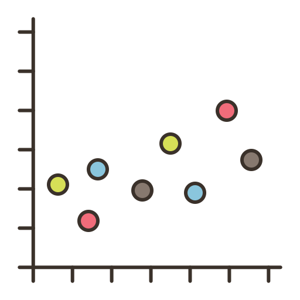
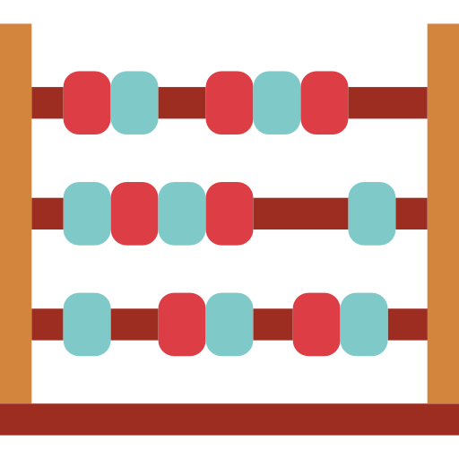

---
output:
  xaringan::moon_reader:
    lib_dir: libs
    nature:
      highlightStyle: github
      highlightLines: true
      countIncrementalSlides: false
    css: ["chocolate-fonts", "styles.css"]
    seal: false
    includes:
      in_header: fonts.html
---

class: center, middle, inverse, title-slide

<div>
  
  <p style = "position: absolute; font-family: Ubuntu Condensed; font-size: 20px; top: 23px; left: 50%; transform: translate(-50%, -50%);">MAT02035 - MODELOS PARA DADOS CORRELACIONADOS</p>
  
</div>

<h1 id="h1-capa">Modelos de Transição<br>(Modelos de Markov)</h1>

<div id = "texto-medio-esquerda"> 
  <h4 style = "font-family: Abel">Angelo Rosa<br>Camila Leuck<br>Gabriel Grandemagne<br>Raquel Rossi<br>Vítor Coutinho</h4>
</div>

<div id = "texto-medio-direita"> 
  <h4 style = "font-family: Abel"><br><br>Professor: Rodrigo Citton</h4>
</div>

<div id="texto-baixo">
  <p style = "font-family: Ubuntu Condensed; font-size: 20px;">Atualizado em `r Sys.setlocale('LC_ALL', 'Portuguese_Brazil.1252'); format(Sys.Date(), format = '%d de %B de %Y')`</p>
</div>

---

```{r prep, include=FALSE}
# Comentários relevantes:
#   - Na seção dos dados categóricos, talvez seja legal botar a parte sobre testar modelos mais simples.

# Opções do knitr/rmarkdown/xaringan:
options(htmltools.dir.version = FALSE)

# Libraries:
ler_libs <- function(packages){
  instalar <- packages[!(packages %in% installed.packages()[, "Package"])]
  
  if(length(instalar) > 0){
    install.packages(pkgs = instalar, dependencies = TRUE)
  }
  invisible(sapply(packages, require, character.only = TRUE))
}

ler_libs(packages = c('leaflet', 'DT'))

# Bases de dados:

```

# Definições Importantes

- Um **processo estocástico** é, de forma simplificada, um modelo matemático utilizado para analisar trajetórias (funções) de fenômenos aleatórios

- Dado um espaço de estados $E$, uma distribuição $\{p_i\}_{i\in E}$ é uma matriz **markoviana** $P$ e uma sucessão de variáveis aleatórias $\{X_n\}_{n=0,\,1,\,...}$ é uma **cadeia de Markov** se e somente se:

<p style = "text-align: center;">$$p[X_0=i_0,\,...,\,X_n=i_n]=p_{i_0}p_{i_0}i_1\,...\,p_{i_{n-1}}i_n\,\,\,\forall{n},\,\,\forall{i_1,\,...,\,i_n\in{E}}$$</p>

---

# Motivação

- Modelos marginais não captam todos efeitos **intra**-indivíduos em estudos longitudinais, apesar de permitirem a especificação de uma estrutura para a matriz de covariância
  + Isto porque os métodos modelam a regressão de $Y$ sobre $x$ e a **associação** entre repetições
  + Não levam em conta a **distribuição** de $Y$ nas repetições anteriores 
  
- Modelos de efeitos aleatórios não resolvem esta questão, pois lidam com a heterogeneidade **entre** indivíduos

- Para resolver este problema, foram desenvolvidas extensões de MLGs para descrever a distribuição condicional da resposta $y_{ij}$ do indivíduo $i$ no tempo $j$ como uma função explícita de suas respostas nos tempos anteriores, dadas por $y_{ij-1},\,y_{ij-2},\,...,\,y_{i1}$, e das covariáveis $x_{ij}$

---

class: img-page

<h1 id="h1-capa" style = "font-family: Abel; text-align: center;">Modelos de Markov</h1>

<i id = "img-center"></i>

---

# Modelos de Markov

- Denotaremos o **histórico** do sujeito $i$ no tempo $j$ por:

<p style = "text-align: center;">$$\mathcal{H}_{ij}=\{y_{ik},\, k = 1,\,...,\,j-1\}$$</p>

- A forma geral do MLG em questão, para $\psi(\theta_{ij})$ e $c(y_{ij},\,\phi)$ conhecidas, é:

<p style = "text-align: center;">$$f(y_{ij}|\mathcal{H}_{ij})=\mathbb{exp}\Big\{\frac{y_{ij}\theta_{ij}-\psi(\theta_{ij})}{\phi}+c(y_{ij},\,\phi)\Big\}$$</p>

- A média e variância condicionais são dadas por:

<p style = "text-align: center;">$$\mu_{ij}^{C}=\mathbb{E}(Y_{ij}|\mathcal{H}_{ij})=\psi'(\theta_{ij})\,\,\text{ e }\,\,v_{ij}^{C}=\mathbb{Var}(Y_{ij}|\mathcal{H}_{ij})=\psi''(\theta_{ij})\phi$$</p>

- Os modelos de transição mais úteis são cadeias de Markov em que a distribuição condicional de $y_{ij}$ dado $\mathcal{H}_{ij}$ depende somente das $q$ observações anteriores
  + Neste caso, $q$ é chamado de **ordem** do modelo

---

# Modelos de Markov

- Vamos considerar modelos em que a média e variância condicionais satisfazem as equações abaixo, em que $h$ e $v$ são as funções de ligação e variância (**conhecidas** de acordo com a distribuição de $f(y_{ij}|\mathcal{H}_{ij})$):

<p style = "text-align: center;">$$\begin{cases}h(\mu_{ij})^C=x'_{ij}\beta+\sum_{r=1}^{s}f_r(\mathcal{H}_{ij};\alpha)\text{,  para }f_r(\cdot)\text{ válidas;}\\v_{ij}^C=v(\mu_{ij}^C)\phi\end{cases}$$</p>

- Expressando $\mu_{ij}^C$ como função tanto de $x_{ij}$ quanto de $y_{ij-1},\,\dots,\,y_{ij-q}$, estamos tratando as respostas anteriores de cada indivíduo como variáveis explicativas adicionais
  + Presumimos que o passado afeta o futuro como uma soma de $s$ termos, cada um destes podendo depender de suas $q$ observações anteriores
  
---

# Modelos de Markov - Exemplos

- Um modelo de regressão linear com erros autorregressivos para dados Gaussianos é um modelo markoviano, de forma:

<p style = "text-align: center;">$$Y_{ij}=x'_{ij}\beta+\sum_{r=1}^{q}\alpha_r(Y_{ij-r}-x'_{ij-r}\beta)+Z_{ij}$$</p>

- Neste modelo, presumimos que os $Z_{ij}$ são independentes e têm distribuições Normais com médias zero

- Este é um modelo de transição com $h(\mu_{ij}^C)=\mu_{ij}^C$, $v(\mu_{ij}^C)=1$ e $f_r=\alpha_r(y_{ij-r}-x'_{ij-r}\beta)$

- Notar que a observação atual, $Y_{ij}$, é função linear tanto de $x_{ij}$ quanto de dos **desvios** anteriores, $Y_{ij-r}-x'_{ij-r}\beta,\,\,r=1,\,\dots,\,q$

---
# Modelos de Markov - Exemplos

- Um modelo de regressão logístico para respostas binárias pode compôr uma cadeia de Markov, como abaixo:

<p style = "text-align: center;">$$\mathbb{logit}\big(\mathbb{P}(Y_{ij}=1|\mathcal{H}_{ij})\big)=x'_{ij}\beta+\alpha y_{ij-1}$$</p>

- Neste modelo, têm-se $h(\mu_{ij}^C)=\mathbb{logit}(\mu_{ij}^C)=\mathbb{log}\Big(\frac{\mu_{ij}^C}{1-\mu_{ij}^C}\Big)$, $v(\mu_{ij}^C)=\mu_{ij}^C(1-\mu_{ij}^C)$ e $f_r(\mathcal{H}_{ij},\alpha)=\alpha_ry_{ij-r},\,s=q=1$.

- Pode-se extendê-lo a um modelo de ordem $q$:

<p style = "text-align: center;">$$\mathbb{logit}\big(\mathbb{P}(Y_{ij}=1|\mathcal{H}_{ij})\big)=x'_{ij}\beta_q+\sum_{r=1}^{q}\alpha_ry_{ij-r}$$</p>

- A notação $\beta_q$ indica que tanto o valor quanto interpretação dos coeficientes no vetor mudam com a ordem $q$ da cadeia de Markov

---

# Modelos de Markov - Exemplos

- Com dados de contagem, pode-se ajustar um modelo log-linear onde $Y_{ij}|\mathcal{H}_{ij}\sim Poisson(\lambda)$:
  + Tomando uma cadeia de Markov de primeira ordem onde $f_1=\alpha\{\mathbb{log}(y^*_{ij-1})-x'_{ij-1}\beta\}$, sendo $y^*_{ij}=\mathbb{max}(y_{ij},d),\,\,0<d<1$, podemos obter:
  
<p style = "text-align: center;">$$\mu_{ij}^C=\mathbb{E}(Y_{ij}|\mathcal{H}_{ij})=\mathbb{exp}(x1_{ij}\beta)\Big(\frac{y^*_{ij-1}}{\mathbb{exp}(x'_{ij-1}\beta)}\Big)^\alpha$$</p>

- A constante $d$ previne que $y_{ij-1}=0$ vire um estado de absorção, onde $y_{ij-1}=0$ força todas respostas futuras a serem zero

- Se $\alpha>0$, a média $\mu_{ij}^C$ cresce quando a observação anterior $y_{ij-1}>\mathbb{exp}(x'_{ij-1}\beta)$
  + Se $\alpha<0$, um valor mais alto no tempo $t_{ij-1}$ causa um valor mais baixo em $t_{ij}$

---

# Modelos de Markov - Observação
  
- Para o modelo de regressão **linear**, pode-se formular o modelo de transição considerando $f_r=\alpha_r(y_{ij-r}-x'_{ij-1}\beta)$, o que leva a $\mathbb{E}(Y_{ij})=x'_{ij}\beta\,\,\,\forall q$

- Para os casos logístico e log-linear, é complexo formular modelos que mantenham a interpretação de $\beta$ para diferentes presunções sobre a dependência temporal
  
- Então, quando $\beta$ é o foco científico do estudo, deve-se examinar a sensibilidade das estimativas relevantes com relação à escolha de modelo de dependência temporal
  
---

class: img-page

<h1 id="h1-capa" style = "font-family: Abel; text-align: center;">Ajustando Modelos de Transição</h1>

<i id = "img-center"></i>

---

# Ajustando Modelos de Transição

O método proposto para estimação do vetor de parâmetros $\beta$ foi o da máxima verossimilhança. Considerando uma amostra aleatória de n observações de uma distribuição exponencial

$f(y_i,\theta_i,\phi)=\mathbb{exp} \Big{\{} \frac{1}{a_i(\phi)}\big{[}y_i \theta_i - b(\theta_i)\big{]}+c(y_i,\phi) \Big{\}}$

A função de verossimilhança é dada por

$L( \theta_i , \phi ,y_i) = \prod_{i=1}^{n} f(y_i, \theta_i , \phi ) = \mathbb{exp}\Big{\{}\sum_{i=1}^{n}\Big{[} \frac{1}{a_i(\phi)}\big{[}y_i \theta_i - b(\theta_i)\big{]}+c(y_i,\phi) \Big{]}\Big{\}}$

Cujo logaritmo é

$l( \theta_i , \phi ,y_i) =\sum_{i=1}^{n}\Big{\{} \frac{1}{a_i(\phi)}\big{[}y_i \theta_i - b(\theta_i)\big{]}+c(y_i,\phi) \Big{\}}$

---

# Ajustando Modelos de Transição

Derivando a última função vista no slide passado em relação a $\beta_j$, obtém-se a função escore

$U_j= \frac{\partial l}{\partial \beta_j} = \frac{\partial l}{\partial \theta_i} \frac{\partial \theta_i}{\partial \mu_i} \frac{\partial \mu_i}{\partial \eta_i} \frac{\partial \eta_i}{\partial \beta_j} = \sum_{i=1}^{n} \frac{1}{a_i(\phi)} (y_i - \mu_i) (\frac{\partial \theta_i}{\partial \eta_i}) x_{ij}$

Soluções aproximadas podem ser encontradas utilizando método Newton-Raphson ou método escore de Fisher, pelo método de Fisher temos:

$\beta^{(m+1)} = (X'W^{(m)}X)^{-1} X'W^{(m)}z^{(m)}$

Onde X é a matriz de especificação do modelo e W é a matriz diagonal de pesos.

---

class: img-page

<h1 id="h1-capa" style = "font-family: Abel; text-align: center;">Análise de Resíduos e Diagnósticos</h1>

<i id = "img-center"></i>

---

# Análise de Resíduos e Diagnósticos

As técnicas usadas são as mesmas dos modelos lineares clássicos, com resposta normal, tanto para as técnicas baseadas em testes de hipóteses como para as baseadas em recursos gráficos. Os resíduos mais usuais para análise e diagnósticos dos MLGs são:

1) Resíduos de Pearson generalizados

$r_i^{p} = \frac{y_i -\hat{\mu_i}}{\sqrt{\frac{\hat{\phi}}{\omega_i}V(\hat{\mu_i})}}$

Em que $\hat{\phi}$ é uma estimativa consistente para o parâmetro de dispersão $\phi$ e $\omega_i$ são presos a priori.

---

# Análise de Resíduos e Diagnósticos

2) Resíduos de Pearson generalizados padronizados internamente

$r_i^{p^i} = \frac{y_i -\hat{\mu_i}}{\sqrt{\frac{\hat{\phi}}{\omega_i}V(\hat{\mu_i})}(1-h_i)}$

Através de estudos de simulação de Monte Carlo a distribuição de resíduos não possuí distribuição normal, mesmo para grandes amostras.

---

# Análise de Resíduos e Diagnósticos

3) Componentes do desvio padronizados internamente

$r_i^{D^i} = \frac{r_i^D}{\sqrt{1-h_i}}$

É a versão padronizada do desvio abaixo. É o mais utilizado, tendo em vista que dentre todos a distribuição do desvio padronizado é a que mais se aproxima da normal.

$r_i^{D} = \pm (y_i - \hat{\mu_i})\sqrt{\frac{2 \hat{\omega_i}}{\hat{\phi}}[y_i(\tilde{\theta_i} - \hat{\theta_i}) - b(\tilde{\theta_i})+b(\hat{\theta_i})]}$

---

class: img-page

<h1 id="h1-capa" style = "font-family: Abel; text-align: center;">Dados Categóricos</h1>

<i id = "img-center"></i>

---

# Dados Categóricos

- Começamos com um modelo logístico para respostas binárias, tal que <p style = "text-align: center;"> $$\begin {pmatrix} \pi_{00} & \pi_{01} \\ \pi_{10} & \pi_{11} \end{pmatrix},$$</p>
onde $\pi_{ab} = \mathbb{P}(Y_{ij}=b|Y_{ij-1}=a),\space a,b=0,1$
- Na configuração de regressão, modelamos a probabilidade da transição como função das covariáveis $x_{ij}=(1,x_{ij1},x_{ij2},\dots,x_{ijp})$. Assumimos que: <p style = "text-align: center;"> $$\mathbb{logit} \space \mathbb{P}(Y_{ij}=1|Y_{ij-1}=0)=x'_{ij}\beta_0\,\,\text{ e }\,\, \mathbb{logit} \space \mathbb{P}(Y_{ij}=1|Y_{ij-1}=1)=x'_{ij}\beta_1,$$</p> onde $\beta_0$ e $\beta_1$ diferem.
  + Em outras palavras esse modelo assume que os efeitos das variáveis explicativas muda dependendo na resposta prévia.

---

# Dados Categóricos

- Um modelo mais coerente pode ser descrito como: <p style = "text-align: center;"> $$\mathbb{logit} \space \mathbb{P}(Y_{ij}=1|Y_{ij-1}=y_{ij-1}) = x'_{ij}\beta_0 + y_{ij-1}x'_{ij}\alpha,$$</p> 

  para que $\beta_1=\beta_0 + \alpha$. A equação acima expressa duas regressões em um único modelo logístico que incluí os preditores das respostas prévias $y_{ij-1}$ assim como a interação de $y_{ij-1}$ com as variáveis explicativas.

- Uma vantagem desse modelo é testar quando um modelo simples se ajusta corretamente aos dados, como por exemplo podemos testar quando $\alpha=(\alpha_0,0)$, então nosso modelo $y_{ij-1}x'_{ij}\alpha=\alpha_0Y_{ij-1}$ implicando que a covariância tem o mesmo efeito na resposta quando $y_{ij-1}=0$ ou $y_{ij-1}=1$.

---

# Dados Categóricos

- Analogamente, observando duas prévias medições no tempos temos que $$\mathbb{logit}\,\mathbb{P}(Y_{ij}=1|Y_{ij-2}=y_{ij-2},\,Y_{ij-1}=y_{ij-1}) \\ = x'_{ij}\beta + y_{ij-1}x'_{ij}\alpha_1+y_{ij-2}x'_{ij}\alpha_2+y_{ij-1}y_{ij-2}x'_{ij}\alpha_3$$ 

- Colocando valores diferentes para $y_{ij-2}\,\text{ e }\,y_{ij-1}$ obtemos: <p style = "text-align: center;"> $\beta_{00}=\beta$; $\,\,\beta_{01}=\beta+\alpha_1$; $\,\,\beta_{10}=\beta+\alpha_2\,\,$ e  $\,\,\beta_{11}=\beta+\alpha_1+\alpha_2+\alpha_3$ </p>

- Um caso importante ocorre quando não há interações entre as respostas prévias $y_{ij-1} \,\text{ e }\,\, y_{ij-2}$, assim como as variáveis explicativas, ou seja, quando todos os elementos de $\alpha_i$ é zero exceto o intercepto. Nesse caso, as respostas prévias afetam a probabilidade de um desfexo positivo porém os efeitos das variáveis explicativas são os mesmos independente de suas outras medições.

---

# Dados Categóricos

- Nessa situação, devemos escolher entre modelos Markov de ordens diferentes, por exemplo, podemos começar com um modelo de terceira ordem da forma $$\mathbb{logit}\,\mathbb{P}(Y_{ij}=1|Y_{ij-3}=y_{ij-3},Y_{ij-2}=y_{ij-2},\,Y_{ij-1}=y_{ij-1}) \\ = x'_{ij}\beta + \alpha_1y_{ij-1}+\alpha_2y_{ij-2}+\alpha_3y_{ij-3}+\alpha_4y_{ij-1}y_{ij-2} \\ +\alpha_5y_{ij-1}y_{ij-3}+\alpha_6y_{ij-2}y_{ij-3}+\alpha_7y_{ij-1}y_{ij-2}y_{ij-3}$$ 

- Um modelo de segunda ordem pode ser usado se os dados são consistentes com $\alpha_3=\alpha_5=\alpha_6=\alpha_7=0$, um modelo de primeira ordem está implicito se $\alpha_j=0 \text{ para } j=2,\dots,7.$. Com qualquer outro coeficiente de regressão, a interpretação e o valor de $\beta$ (no modelo de terceira ordem) depende nas outras variáveis explicativas no modelo, em particular nas quais as respostas prévias está inclusa.

---

# Dados Categóricos

- Quando os modelos de Markov são bem especificados, os eventos de transição não são correlacionados, então podemos utilizar regressão logística para estimar os coeficientes de regressão e seus erros-padrões. Entretanto pode haver circunstâncias quando escolhemos modelar $\mathbb{P}(Y_{ij}\,|\,Y_{ij-1},\dots,Y_{ij-q})$ mesmo não sendo igual à $\mathbb{P}(Y_{ij}\,|\,H_{ij})$. Por exemplo, supondo heterogeneidade entre os indivíduos na matrix de transição, um modelo rasoavel é <p style = "text-align: center;"> $$\mathbb{P}(Y_{ij}=1\,|\,Y_{ij-1},\, U_i)=(\beta_0+U_i)+x'_{ij}\beta+\alpha y_{ij-1},$$</p> onde $U_i$ ~ $N(0,\sigma^2)$.

---

# Dados Categóricos - Exemplo

-  Um estudo feito com crianças da indonésia a fim de mensurar o quanto a deficiência de vitamina A (indicada no banco pela presença da doença xerophtalmia) está associada com uma maior prevalência de infecções respiratórias.

- Na tabela abaixo mostramos a contagem das transições entre um estado e outro ao longo das 1200 observações, a fim de ter uma estimação das probabilidades de transição ignorando, por hora, a dependência das covariáveis explanatórias.

-Tabela 1:


---

# Dados Categóricos - Exemplo

- As taxas acima estimam $Pr(Y_{ij} |Y_{ij-1})$. Podemos perceber:

  + 1) Ocorreram 855 transições nas 1200 observações,
  + 2) Para crianças que não possuiam doenças respiratórias na primeira visita, **7,7%** passuiam na segunda visita, enquanto **13,5%** dos que possuíam doenças respiratórias  na primeira visita também possuiam na segunda visita.
  
- Vejamos agora a distribuição da variável resposta, dado a presença de xerophtalmia $(X_{ij} = 1)$.
- Tabela 2:


---

# Dados Categóricos - Exemplo

- Podemos perceber que a proporção de crianças com deficiência de vitamina A e com infeções respiratórias é maior do que a proporção de crianças com o mesmo status e sem deficiência de vitamina A.

- A próxima tabela contém o cruzamento das informações dadas nas tabelas anteriores, a fim de ter uma maior noção do comportamento da variável resposta sob influência do status anterior $(Y_{ij-1} = 0,1)$ e da presença de xerophtalmia (indicador de deficiência de vitamina A).
-Tabela 3:


---

# Dados Categóricos -  Exemplo

- Com esses dados, percebemos que para o primeiro cenário, $Y_{ij} = 0$ na visita anterior, a frquencia de infecção respiratória é 1.49 vezes maior entre indivíduos que apresetam xerophtalmia, enquanto no segundo cenário, $Y_{ij} = 1$ na visita anterior, a proporção de indivíduos com doenças respiratórias é 1.54, assim vemos que para os dois cenários os resultados quanto ao efeito da xerophtalmia são semelhantes, embora $Y_{ij-1}$ seja um bom preditor de $Y_{ij}$.

  + Dado as análises exploratórias, sugerimos um modelo logit $Pr(Y_{ij}=1|Y_{ij-1}=y_{ij-1}) = x_{ij} \beta + \alpha y_{ij-1}$

- Ajustamos modelos utilizando as variáveis mostradas anteriormente e alguns resultados são abordados na tabela a seguir,
a tabela também contém informações de modelos utilizando outras covariáveis.

---

# Dados Categóricos -  Exemplo
- Tabela 4:


---

# Dados Categóricos -  Exemplo

- Modelo 1) A tabela contém o coeficiente da regressão, o erro padrão definido por procedimentos comuns de regressão logística e o erro padrão robusto. O primeiro modelo leva em conta apenas a presença de Xerophtalmia e suas estimações devem reproduzir a Tabela 2. Percebam que a frequencia de crianças sem xerophtalmia com infecções respiratórias é **8,0%** = $\text{exp}\frac{(-2.44)}{[1+exp(-2.44)]}$. Calculando o log odds ratio da Tabela 2 obetmos: $log\Bigg[\frac{(0.119/0.881)}{(0.080/0.920)}\,\Bigg]=0.44,$ que é o coeficiente da variável xerophtalmia na tabela 4

---

# Dados Categóricos -  Exemplo

- Modelo 2) Contém uma análise que vê a diferença na associação de xerophtalmia e doenças respiratórias quanto a presença de doenças respiratórias na visita anterior do indivíduo e deve reproduzir as taxas de transição da Tabela 3.

  + Olhando para as crianças sem infecção respiratória o log odds ratio para xerophtalmia é igual ao coeficiente para xerophtlamia (atual visita) no modelo 2 $(log[(0.108/0.892)/(0.075/0.925] = 0.40)$. Assim, o log odds ratio para crianças com infecção na visita aterior será 0.40 + 0.11= 0.51 (efeito de $xerophtalmia + infecçao*xerophtalmia$ na visita anterior)

---

# Dados Categóricos -  Exemplo

- Quando comparamos a Tabela 2 com Tabela 3 obtemos indícios que o efeito de xerophtalmia é similar entre os indivíduos que pussuíam ou não infecção na visita anterior, os resultados do modelo 2 nos confirmam isso, afinal, temos que o IC95 para o coeficiente da interação $infecção*xerophtalmia$ é (-2.1 ;2.3), inclusive, essa interação foi retirada no modelo 3.

  + Os modelos anteriores ilustram bem regressões logísticas ajustadas a cadeias de markov simples, tal formulação nos permite adicionar com facilidade covariáveis ao modelo, assim, vemos os efeitos ao adicionar as variáveis idade e um indicador dicotômico de temporada, (1 = 2º quadrimestre, 0 = Outro).

---

# Dados Categóricos -  Exemplo

- Modelo 4: Foi ajustado um modelo com todas as variáveis descritas e suas interações  com $Y_{ij-1}$ (seria o mesmo que calcular regressões separadas para os casos em que $Y_{ij-1} = 0, 1$). Como nenhuma das interações teve importância, elas foram retiradas no Modelo 5.

- Em modelos de transição é importante checar o quanto as inferências da regressão sobre $\beta$ mudam em conjunto com a dependência da variável resposta com o tempo. Assim, para ilustrar, vamos apresentar os resultados quando adicionamos $Y_{ij-2}$ ao Modelo 5:

  + 1) A influência de $Y_{ij-1}$ e da Temporada diminui.
  + 2) O coeficiente de xerophtalmia aumenta para 1.73, aproximadamente o dobro do coeficinete no modelo 5.

---

# Dados Categóricos -  Exemplo

- Assim, mostramos uma importante propriedade dos modelos de transição: As variáveis explicativas e as respostas anteriores são tratadas simetricamente como preditores da variável resposta, desse modo, as interpretações quanto as variáveis explicativas vão mudar quando a influência das respostas antriores sofrerem mudanças. É interessante checar a sensitividade do efeito das covariáveis quanto à diferentes modelos com dependência de tempo.

---

class: img-page

<h1 id="h1-capa" style = "font-family: Abel; text-align: center;">Dados de Contagem</h1>

<i id = "img-center"></i>

---

# Dados de Contagem

---


class: img-page

<h1 id="h1-capa" style = "font-family: Abel; text-align: center;">Modelando no R</h1>

<i id = "img-center"></i>

---

# Modelando no R

---

# Conclusões

---

# Agradecimentos

---

# Referências e Link Úteis
